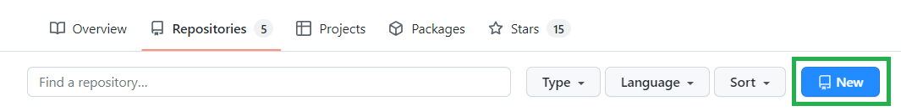
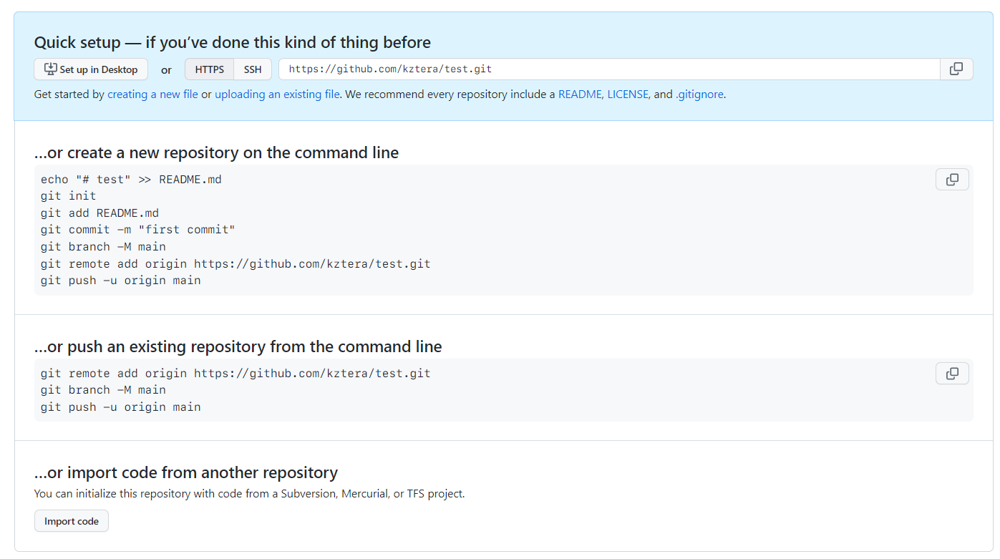

<h1> Git - Github study </h1>

<p><i>Just a summary of the most important commands and concepts of Git and Github. My development environment is Windows 11, but after installing Git Bash on a Windows computer, users have the same set of Git commands available as in Git's native environment (a Unix-style system like Linux or macOS).</i></p>

<h1> Table of Contents </h1>

-  [I. Git](#i-git)
   -  [I.1. What is Git?](#i1-what-is-git)
   -  [I.2. Git Installation and Configuration](#i2-git-installation-and-configuration)
      -  [I.2.1. Install Git](#i21-install-git)
      -  [I.2.2. Configure Git](#i22-configure-git)
   -  [I.3. Git terms](#i3-git-terms)
      -  [I.3.1. Repository](#i31-repository)
      -  [I.3.2. Working directory](#i32-working-directory)
      -  [I.3.3. Staging area](#i33-staging-area)
      -  [I.3.4. Commit](#i34-commit)
      -  [I.3.5. Branch](#i35-branch)
      -  [I.3.6. Merge](#i36-merge)
      -  [I.3.15. Origin](#i315-origin)
      -  [I.3.16. HEAD](#i316-head)
      -  [I.3.17. Master](#i317-master)
      -  [I.3.18. Stash](#i318-stash)
      -  [I.3.19. Log](#i319-log)
      -  [I.3.20. .gitignore](#i320-gitignore)
   -  [I.4. Git basic command](#i4-git-basic-command)
      -  [I.4.1. git status](#i41-git-status)
      -  [I.4.2. git init](#i42-git-init)
      -  [I.4.3. git add](#i43-git-add)
      -  [I.4.4. git commit](#i44-git-commit)
      -  [I.4.5. git log](#i45-git-log)
      -  [I.4.6. git branch](#i46-git-branch)
      -  [I.4.7. git checkout and git switch](#i47-git-checkout-and-git-switch)
      -  [I.4.8. git merge](#i48-git-merge)
      -  [I.4.9. git diff](#i49-git-diff)
      -  [I.4.10. git stash](#i410-git-stash)
      -  [I.4.11. git reset](#i411-git-reset)
      -  [I.4.12. git config](#i412-git-config)
      -  [I.4.13. git mv](#i413-git-mv)
      -  [I.4.14. git rm](#i414-git-rm)
      -  [I.4.15. git restore](#i415-git-restore)
      -  [I.4.16. git revert](#i416-git-revert)
-  [II. Github](#ii-github)
   -  [II.1. What's the difference between Git and Github?](#ii1-whats-the-difference-between-git-and-github)
   -  [II.2. Github basic](#ii2-github-basic)
      -  [II.2.1. Clone a Repo](#ii21-clone-a-repo)
         -  [II.2.1.1. Cloning Github Repos With Git Clone](#ii211-cloning-github-repos-with-git-clone)
         -  [II.2.1.2. Cloning Non-Github Repos](#ii212-cloning-non-github-repos)
      -  [II.2.3. Setup SSH Key (Optional)](#ii23-setup-ssh-key-optional)
         -  [II.2.3.1. Generate SSH Key](#ii231-generate-ssh-key)
      -  [II.2.4. Create a Repo](#ii24-create-a-repo)
         -  [II.2.4.1. Create a new repository from scratch](#ii241-create-a-new-repository-from-scratch)
         -  [II.2.4.2. Import an existing project](#ii242-import-an-existing-project)
      -  [II.2.5. Push to a Repo (git push)](#ii25-push-to-a-repo-git-push)
      -  [II.2.6. Remote tracking branches](#ii26-remote-tracking-branches)
         -  [II.2.6.1. Fetching](#ii261-fetching)
         -  [II.2.6.2. Pulling](#ii262-pulling)
      -  [II.2.7. Repo visibility and access](#ii27-repo-visibility-and-access)
      -  [II.2.8. Fork a Repo](#ii28-fork-a-repo)
      -  [II.2.9. Github Collaborators](#ii29-github-collaborators)
      -  [II.2.10. Github Pages](#ii210-github-pages)
      -  [II.2.11. What's the README file?](#ii211-whats-the-readme-file)
      -  [II.2.12. LICENSE](#ii212-license)

---

# I. Git

## I.1. What is Git?

Simplify, Git is a tool that helps developers keep track of changes made to their code. It allows multiple people to work on the same codebase without causing conflicts. It also helps developers undo changes or experiment with new features without affecting the main codebase. Git is widely used in software development because it is flexible, fast, and reliable. There are also many tools and services available that integrate with Git, making it easy to use in various development workflows.

You can think of Git as a time machine that allows you to travel back to previous versions of your code. It also allows you to travel to different timelines, where you can create new versions of your code without affecting the main timeline. This is useful when you want to experiment with new features without affecting the main codebase.

About history of Git, you can check it by yourself [here](https://www.geeksforgeeks.org/history-of-git/).

## I.2. Git Installation and Configuration

### I.2.1. Install Git

You can download Git [here](https://git-scm.com/downloads). After downloading, you can install Git by following the instructions on the screen.

If you have installed Git successfully, you can check the version of Git by typing the following command in your terminal:

```bash
git --version
```

And update Git to the latest version by typing:

```bash
git update-git-for-windows
```

### I.2.2. Configure Git

Config Git is very important. It will help you to identify who you are when you commit changes to the repository. Just open your terminal and type:

```bash
git config --global user.name [your_username]
git config --global user.email [your_email]
```

Example:

```bash
git config --global user.name "Mr Brown"
git config --global user.email browninsuit@gmail.com
```

## I.3. Git terms

### I.3.1. Repository

A repository is a storage space where you can keep all the files related to your project, including code, documentation, and other resources. It's like a folder or directory on your computer, but with additional features that make it easy to manage changes and collaborate with others. In Git, a repository is also known as a "repo" and it tracks changes made to the files in the repository over time. Developers use repositories to manage their code and collaborate with others on the same project.

### I.3.2. Working directory

The working directory is the directory on your local computer where you have your Git repository files stored. It's the directory where you make changes to the files in your repository. When you make changes to files in the working directory, Git detects the changes and allows you to stage and commit them to the repository. In other words, the working directory is the place where you do your work and make changes to your code, while the repository is the place where Git tracks and manages those changes.

### I.3.3. Staging area

In technical terms, the staging area is the middle ground between what you have done to your files also known as the [working directory](#i32-working-directory) and what you had last committed (the [HEAD](#i316-head) commit). As the name implies, the staging area gives you space to prepare (stage) the changes that will be reflected on the next [commit](#i34-commit).

### I.3.4. Commit

In Git, a commit is like taking a picture of the changes you made to your code. When you make changes to your code, you can use the "git commit" command to save those changes to the Git repository. Each commit has a unique identifier that allows you to track the changes you've made over time. This is useful for collaboration, debugging, and keeping track of your project's history.

### I.3.5. Branch

In Git, a branch is a separate line of development that allows you to work on new features or make changes to your code without affecting the main codebase.

When you create a branch, you're essentially creating a copy of the current codebase. You can make changes to the files in the branch without affecting the main codebase. This allows you to experiment with new features or make changes without worrying about breaking the existing code. Once you're done making changes in the branch, you can merge the changes back into the main codebase.

Branches are important in Git because they allow developers to work on multiple features or bug fixes at the same time without interfering with each other. They also allow developers to collaborate on the same codebase without stepping on each other's toes. Overall, branches are a powerful feature in Git that allow developers to work more efficiently and safely.

### I.3.6. Merge

In Git, a merge is when you combine changes from one branch into another. This allows you to incorporate changes made in a separate branch back into the main codebase. Merging is important because it allows developers to work on separate branches without interfering with each other. It's like taking different versions of a story and combining them into a single, cohesive narrative. Once the changes are merged, you have a complete picture of the changes made to the codebase.

### I.3.15. Origin

In Git, the origin is the remote [repository](#i31-repository) that you cloned from. It's the repository that you use to push and pull changes to and from. When you clone a repository, Git automatically creates a remote connection to the original repository. This is called the "origin" remote. You can use the `git remote` command to view the remote connections in your repository.

### I.3.16. HEAD

HEAD is a reference to the last commit in the current [branch](#i35-branch). It's like a pointer that points to the last commit in the current branch. When you make changes to your code, Git creates a new commit and moves the HEAD pointer to point to the new commit. This is useful because it allows you to easily see which commit you're currently working on.

### I.3.17. Master

The default branch in Git is called "master". When you create a new repository, Git automatically creates a branch called "master" and sets it as the default branch. You can use the "git branch" command to view the branches in your repository.

### I.3.18. Stash

Stashing is a way to temporarily save changes that you don't want to commit immediately. It's useful when you want to switch branches but don't want to commit the changes you've made to the current branch.

### I.3.19. Log

Every commit in Git has a unique identifier called a "SHA". The SHA is a 40-character string of letters and numbers that uniquely identifies the commit. Log is a command that shows the history of commits in the current branch. It's useful when you want to see the history of commits in the current branch.

### I.3.20. .gitignore

.gitignore is a file that tells Git which files to ignore. It's useful when you want to exclude certain files from your repository. For example, you might want to exclude files that contain sensitive information like passwords or API keys. You can also use .gitignore to exclude files that are generated by your code, like build files or temporary files.

When you create a new repo in Github, you can choose to add a .gitignore file and .gitignore templates will be suggested based on the programming language you're using. You can also create your own .gitignore file and add the files you want to ignore.

You can create a .gitignore file by using this website in [here](https://www.toptal.com/developers/gitignore). It allows you to choose more than one template and it will generate a .gitignore file for you.

## I.4. Git basic command

### I.4.1. git status

`git status` is a command that shows the status of the [working directory](#i32-working-directory) and the [staging area](#i33-staging-area). It lets you see which changes have been staged, which haven't, and which files aren't being tracked by Git. This is useful when you want to check the status of your repository before committing your changes.

```bash
git status
```

Example output:

```bash
On branch master
Your branch is up to date with 'origin/master'.

Changes not staged for commit:
  (use "git add <file>..." to update what will be committed)
  (use "git restore <file>..." to discard changes in working directory)
        modified:   README.md

no changes added to commit (use "git add" and/or "git commit -a")
```

### I.4.2. git init

`git init` is a command to starts a new Git repository in a directory. This allows you to track changes to your code over time and collaborate with others. It's like setting up a new journal to write down your thoughts and ideas. Once you've initialized a Git repository, you can start making commits to track changes to your code.

```bash
git init
```

Output:

```bash
Initialized empty Git repository in C:/Users/username/Desktop/MyProject/.git/
```

### I.4.3. git add

In Git, `git add` is a command that adds files to the staging area in preparation for committing them to the repository. When you make changes to your code, you can use "git add" to tell Git which files you want to include in your next commit. You can use `git add .` to add all files in the working directory to the staging area.

### I.4.4. git commit

`git commit` is a command that saves changes to the repository. When you make changes to your code, you can use "git commit" to save those changes to the repository. Each commit has a unique identifier that allows you to track the changes you've made over time. This is useful for collaboration, debugging, and keeping track of your project's history.

With `git commit`, you can use the `-m` flag to add a message to your commit. This is useful for keeping track of what changes you made in each commit. You can also use the `-a` flag to automatically stage all changes before committing them to the repository.

```bash
git commit -m "Add README.md"
```

Or

```bash
git commit -am "Add README.md"
```

`git commit -am` is equivalent to `git add .` followed by `git commit -m`.

Message should be in present tense, and should not be capitalized. Make it short and meaningful.

### I.4.5. git log

`git log` is a command that shows the commit history for a repository. It lets you see the commit messages, the author, and the date of each commit. This is useful when you want to check the history of your repository to see what changes have been made.

### I.4.6. git branch

`git branch` is a command that shows the [branches](#i35-branch) in a repository. It lets you see which branches exist and which branch you're currently on. This is useful when you want to check the status of your repository before committing your changes.

When you want delete a branch, use `git branch -d <branch_name>`.

### I.4.7. git checkout and git switch

To create a new branch, use `git branch <branch_name>`. To switch to an existing branch, use `git checkout <branch_name>`. To create a new branch and switch to it, use `git checkout -b <branch_name>`.

But now, we have a new command `git switch` to switch between branches. It is more intuitive than `git checkout`. To create a new branch and switch to it, use `git switch -c <branch_name>`.

In other case, you can use `git checkout <commit-hash>` to view the code at that commit. Don't forget you can use `git log` to see the commit history. We just need the first 7 characters of the commit hash.

You can use `git checkout HEAD~<number>` to view the code at HEAD - number commits. For example, `git checkout HEAD~1` to view the code at HEAD - 1 commit. `git checkout HEAD~2` to view the code at HEAD - 2 commits and so on.

To go back to the latest commit, use `git checkout master`.

Use `git checkout HEAD <file_name>` to discard changes in the working directory that something you've changed but haven't committed yet. You can replace `HEAD` with `--`. For example, `git checkout -- README.md`.

### I.4.8. git merge

`git merge` is a command that allows you to combine changes from one branch into another. When you merge branches, Git takes the changes made in the source branch and applies them to the target branch.

Merging is useful because it allows you to incorporate changes made in a separate branch back into the main codebase. Once changes are made in a separate branch, they can be reviewed and tested before being merged back into the main codebase.

There are different ways to perform a merge in Git, depending on the circumstances. For example, you can perform a fast-forward merge when the target branch hasn't diverged significantly from the source branch, or you can perform a three-way merge when the two branches have conflicting changes.

### I.4.9. git diff

`git diff` is a command that shows the differences between the working directory and the staging area, or between the staging area and the repository. It lets you see which changes have been staged, which haven't, and which files aren't being tracked by Git. This is useful when you want to check the status of your repository before committing your changes.

Besides, you can use `git diff <branch_name>` to compare the differences between the current branch and the specified branch.

### I.4.10. git stash

`git stash` is a command that temporarily stores changes to the working directory. It lets you save changes to your code without committing them to the repository. This is useful when you want to switch branches but don't want to commit your changes yet.

Use `git stast pop` to remove the most recent stash from the stash list and re-apply them to the working directory. `git stash list` to list all stashes. `git stash drop` to remove the most recent stash from the stash list. `git stash apply` to apply to the working directory but not remove it from the stash list. This is useful when you want to apply the same stash to multiple branches.

So, How about multiple stashes? Use `git stash list` to list all stashes. Use `git stash apply stash@{<index>}` to apply the stash at the specified index. Use `git stash drop stash@{<index>}` to remove the stash at the specified index.

Example:

```bash
git stash list

stash@{0}: WIP on master: 4d1b0a9 Add README.md
stash@{1}: WIP on master: 4d1b0a9 Add README.md
stash@{2}: WIP on master: 4d1b0a9 Add README.md
```

```bash
git stash apply stash@{1}
```

[git stash docs](https://git-scm.com/docs/git-stash)

### I.4.11. git reset

Suppose you've just made a couple of commits on the master branch, but you actually meant to make them on a separate branch instead. To undo those commits, you can use `git reset`

`git reset <commit-hash> will reset the repo back to a specific commit. The commits are gone but the changes are still there.

If you want to undo both the commit and the actual changes in your file, you can use the `--hard` option. For example, `git reset --hard HEAD~1` will be delee the last commit and associated changes.

[git reset docs](https://git-scm.com/docs/git-reset)

### I.4.12. git config

`git config` is a command that lets you configure Git. You can use it to set up your name and email address, change the default text editor, and more. You have two options for configuring Git: you can use the `--global` flag to configure Git for all repositories on your computer, or you can use the `--local` flag to configure Git for a specific repository.

### I.4.13. git mv

`git mv` is a command that lets you rename files and move them to different directories. It's like using the `mv` command to move a file, but it also tells Git to track the file's new location. This is useful when you want to rename a file or move it to a different directory.
Example, when you want rename `README.md` to `README`, you can use `git mv` to do it.

```bash
git mv README.md README
```

### I.4.14. git rm

`git rm` is a command that lets you remove files from the working directory and the staging area. It's like using the `rm` command to remove a file, but it also tells Git to stop tracking the file. This is useful when you want to remove a file from your repository.

### I.4.15. git restore

`git restore` helps with undoing operations. It's a new command, most of the existing Git tutorials and book do not mention it.

Suppose you've made some changes to a file since the last commit. You've saved the file but then realize you don't want to commit those changes anymore. To restore the file to the content in the HEAD, use

```bash
git restore <file_name>
```

-  NOTE: The above command is not "undoable". If you have uncommited changes in the file, they will be lost.

`git restore <file_name>` using HEAD as the default source, but we can change that using the `--source` option. For example, `git restore --source=HEAD~1 <file_name>` to restore the file to the content in the HEAD - 1 commit.

And when you want comeback to the latest commit, use `git restore <file_name>`.

Use `git restore --staged <file_name>` to unstage a file.

So many commands to undo changes, right? But you don't need to remember all of them. When you use `git status`, you will receive a message like this:

```bash
Changes not staged for commit:
(use "git add <file>..." to update what will be committed)
(use "git restore <file>..." to discard changes in working directory)
modified:   README.md
```

You can read it in [here](https://stackoverflow.com/questions/58003030/what-is-the-git-restore-command-and-what-is-the-difference-between-git-restor) to know the difference between `git restore` and `git reset`.

[git restore docs](https://git-scm.com/docs/git-restore)

### I.4.16. git revert

`git revert` is similar to `git reset` that they both `undo` changes, but they accomplish it in different ways.

`git reset` actually moves the branch pointer backwards, eliminating commits.

`git revert` instead creates a brand new commit which reverses/undos the changes from a commit. Because it results in a new commit, you will be prompted to enter a commit message.

`git revert` is a safer option than git reset because it creates a new commit. This means that you can revert a commit without losing any of the work you've done since then.

So, **which one should I use?**

Both `git reset` and `git revert` help us reverse changes, but there is a significant difference when it coms to collaboration (which we have yet to discuss but is coming up soon!)

If you want to reverse some commits that other people already have on their machines, you should use **`revert`**.

If you want to reverse commits that you haven't shared with other, use **`reset`** and no one will ever know!

[git revert docs](https://git-scm.com/docs/git-revert)

---

# II. Github

## II.1. What's the difference between Git and Github?

Git and Github are related but distinct tools.

Git is a distributed version control system that allows developers to keep track of changes to their code and collaborate with others. It's a command-line tool that runs on your local computer and manages the changes to your code.

Github, on the other hand, is a web-based platform that provides hosting for Git repositories. It allows developers to store their Git repositories on Github's servers and collaborate with others on their projects. Github provides a user-friendly interface for managing Git repositories, as well as features like pull requests, issue tracking, and project management tools.

In summary, Git is a tool for managing code changes locally, while Github is a web-based platform that provides hosting for Git repositories and collaboration tools. While Git can be used independently of Github, Github relies on Git as its underlying technology.

**Why you should use Github (or at least know how to use it)?**

-  **Collaboration:** If you ever plan on working on a project with at least one other person, Github will make your life much easier. Whether you're building a hobby project with your friend or you're collaborating with the entire world, Github is essential!
-  **Open source projects:** Today Github is the home of open source projects on the Internet. Projects ranging from React to Swift are hosted on Github. If you plan on contributing to open source projects, you'll need to get comfortable working with Github.
-  **Exposure:** Your Github profile can showcases your own projects and contributions to other's projects. It can act as sort resumé that many employers will consult in the hiring process. Additionally, you can gain some clout on the platform for creating or contributing to popular projects.
-  **Stay up to date:** Being active on Github is the best way to stay up to date with the projects and tools you rely on. Learn about upcoming changes and he decisions/debate behind them. You can also get a sense of the direction of the project and the community around it.

## II.2. Github basic

### II.2.1. Clone a Repo

Often we want to get a local copy of an existing repository. To do this, we can clone a remote repo hosted on Github or similar websites. All we need is a URL that we tell Git to clone for use

#### II.2.1.1. Cloning Github Repos With Git Clone

When you want download a repo from Github, you can use `git clone` to do it. First, you need to get the repo's URL. You can get it from the repo's page on Github.


Then, you can use `git clone` to download the repo.

```bash
git clone https://Github.com/kztera/git-Github-study.git
```

A copy of the repo will be downloaded to your local computer.

#### II.2.1.2. Cloning Non-Github Repos

### II.2.3. Setup SSH Key (Optional)

SSH key is a way to authenticate yourself to Github without using your username and password. It's more secure than using username and password. You can use SSH key to push to a repo.

#### II.2.3.1. Generate SSH Key

### II.2.4. Create a Repo

You can create a new repository on Github in two ways: you can create a new repository from scratch, or you can create a new repository by importing an existing project.

#### II.2.4.1. Create a new repository from scratch

First, you need to login to your Github account. Then, click the `New` button on the top right corner of the page Reopositories.



Then, you can create a new repository by following the instructions on the page.

#### II.2.4.2. Import an existing project

Go to the website https://Github.com/new/import, and follow the instructions on the page.

### II.2.5. Push to a Repo (git push)

Pushing to Github means uploading to a Github repository.

Maybe you just created a new public repository for a project and you want to upload all your files to it. Or maybe you're continually working on a project from a private Github repository for your company, and you want to upload the latest changes that you've made.

You can follow the steps when creating a new repository to push to a repo like this:



### II.2.6. Remote tracking branches

Remote tracking branches are references to the state of branches in your remote repositories. They're local branches that you can't move; they're moved automatically whenever you do any network communication. Remote tracking branches act as bookmarks to remind you where the branches on your remote repositories were the last time you connected to them.

#### II.2.6.1. Fetching

Fetching is the process of downloading commits, files, and refs from a remote repository into your local repository. Fetching is what you do when you want to see what everybody else has been working on. Fetching is the opposite of pushing.

Each remote you have is stored under a shortname. By default, git gives the name `origin` to the server you cloned from, so that's what you'll see in most of the examples in this book. If you run `git remote -v`, you can see all the remote repositories you have configured.

#### II.2.6.2. Pulling

Pulling is the act of fetching from a remote repository and then immediately merging it into your local repository. Pulling is what you do when you want to download changes and immediately merge them into your working branch. Pulling is essentially a combination of fetching and merging.

In a workflow where you're using a remote repository as a central point for collaboration, you'll want to make sure that you're always working with the most up-to-date changes. The best way to do this is to always fetch and merge data from the remote repository before you start working on a new feature or bug fix.

### II.2.7. Repo visibility and access

A repository can be public or private. Public repositories are visible to everyone, while private repositories are only visible to you and the people you choose to share them with. You can also choose to make your repository public or private when you create it and change it at any time.


### II.2.8. Fork a Repo

Forking a repository is a way to create a copy of the original repository on your Github account. Forking a repository allows you to freely experiment with changes without affecting the original project. Once you're done experimenting, you can submit a pull request to the original project to propose your changes.

In other words, forking a repository is a way to contribute to an open source project without having to be a collaborator on the project. You can fork a repository, make changes to the code, and submit a pull request to the original repository to propose your changes.


### II.2.9. Github Collaborators

Collaborators are people with read and write access to a repository who can work with you on a project. You can add collaborators to a repository when you create it or at any time after. You can also remove collaborators at any time.

[Documentation](https://docs.Github.com/en/Github/setting-up-and-managing-your-Github-user-account/inviting-collaborators-to-a-personal-repository)

### II.2.10. Github Pages

Github Pages is a static site hosting service that takes HTML, CSS, and JavaScript files straight from a repository on Github, optionally runs the files through a build process, and publishes a website. You can use Github Pages to host a website for your project directly from a Github repository.

Since Github pages support custom domains, you can host a static website on Github pages free of charge, with deploys straight from Github. To know more about Github pages, you can read [this](https://docs.Github.com/en/pages/getting-started-with-Github-pages/about-Github-pages).

### II.2.11. What's the README file?

I found a repo talk about it. You can read it [here](https://Github.com/margittennosaar/markdown_study_materials). It also write about markdown and how to write a good README file

### II.2.12. LICENSE

License is a legal document that gives you permission to use, copy, modify, and distribute the software. It's important to include a license in your project because it protects you from people who want to use your code without giving you credit. It also protects you from people who want to use your code to make money without paying you. In other words, a license is a legal document that protects you from people who want to use your code without giving you credit. It also protects you from people who want to use your code to make money without paying you. A popular license is the MIT license, which allows people to use your code for any purpose, as long as they give you credit.

You can add a license to your project by creating a file called `LICENSE` in your repository. You can also add a license to an existing repository by clicking the `Add a license` button on the repository's page.
